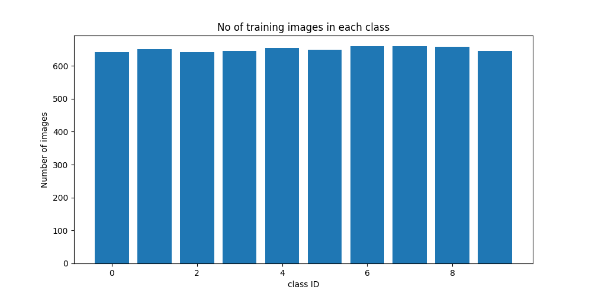
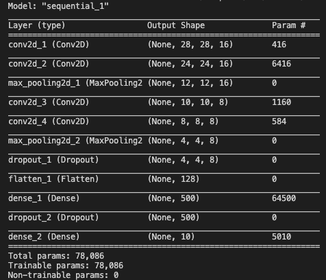
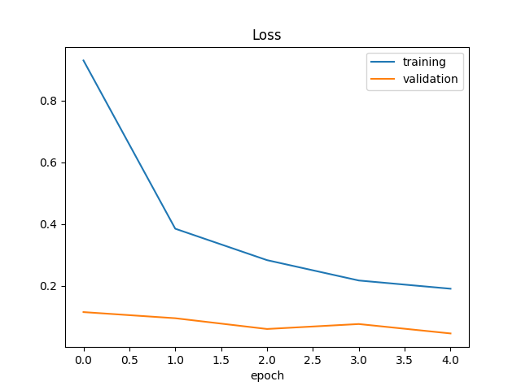
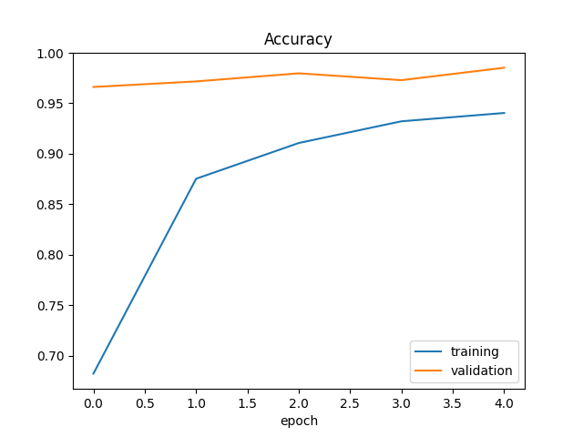

# DIGIT-RECOGNITION
# Overview
Here the trained images are not mnist type
I just written the code in a fashion that every image of every class is converted to array and stored into list and their classes too
then these images are agumentd for better results and we can increse mode data.
Training Data Distribution 

# Model Architecture

# Loss

# Accuracy

